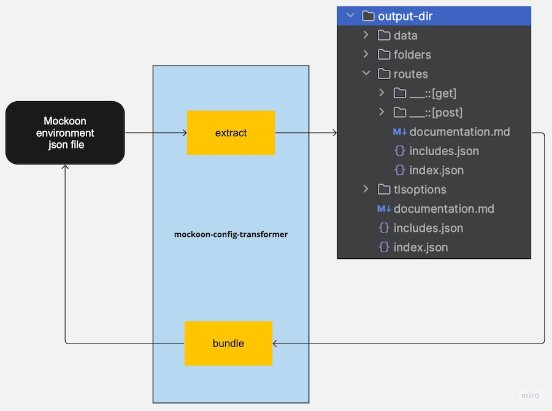

# mockoon-config-transformer

[](https://www.npmjs.com/package/mockoon-config-transformer)
[](https://www.npmjs.com/package/mockoon-config-transformer)
[](https://github.com/edtoken/mockoon-config-transformer/blob/main/LICENSE.md)

A CLI tool to bundle/extract [Mockoon](https://mockoon.com/) environment files in a git-friendly files tree with 100% backward compatibility.



## Features
- Extracts the original big Mockoon environment file into a user-friendly (git-friendly) file tree.
- Generates the markdown documentation files based on documentation fields of the Mockoon environment file.
- Bundle extracted files tree to the environment file that equals the original file.

See [examples](./examples):
- Original Mockoon stripe config [environment.json](./examples/environments/stripecom/environment.json)
- Extracted Mockoon stripe config [json tree](./examples/environments/stripecom/extract/json)
- Extracted automatically generated [documentation.md](./examples/environments/stripecom/extract/json/documentation.md)
- Bundled json tree [from-json.json](./examples/environments/stripecom/bundle/from-json.json)

### Extract features
- Correctly processed any URI with any special chars
- Correctly processed any duplicated routes/responses/data edge cases of the Mockoon configuration
- Compatibility with Mockoon configuration structure updates (unexpected properties will be processed)
- Correctly processed edge cases with OS file issues (file/directory name length)
- Extracted routes directory tree related to the route-endpoint path
- Response body extracted to the multiline file
- Data bucket value extracted to the multiline file

### Bundle features
- The bundled environment is not based on escaped directory names.
- Correctly restores array ordering (routes, responses, etc)
- Correctly restores unknown properties

## Motivation
Actually, Mockoon stores each environment file in one JSON file.
This file has a big and complex structure, and finally,
this makes it impossible to resolve control-version conflicts when a few developers work in the same environment same time.

Developers need something right now, to be able to store environment files in control version systems and have clean review processes of the environment updates.

At some time Mockoon will have git friendly environment file structure, and because of that the main principle is:

This tool works with the Mockoon environment file does not add any extra values, and fully restores the original Mockoon config to allow you to stop using this tool at any time.


## How is the CLI tool tested?
Mockoon has 2000+  [samples](https://Mockoon.com/mock-samples/category/all/) of the APIs, which is hosted in the [mock-samples](https://github.com/Mockoon/mock-samples) repo.

Each release of that CLI tool includes a test of these APIs that described in the samples could be extracted and then correctly bundled. That means any feature that is used in the mock-samples of the Mockoon is correctly processed by the CLI tool.  

For the edge cases (e.g. dirs that are not used in the mock-samples, or dirs with the same names) we have the examples dir, where described a few examples and specific edge cases and these examples also used in the tests.

So the release means all Mockoon mock-samples are correctly extracted and then bundled and the bundles are equal to the original environment files, and some edge cases are also tested.

## Installing
```
$ npm install mockoon-config-transformer --save-dev
# or 
$ yarn add mockoon-config-transformer --dev
```

## CLI
```
Usage: mockoon-config-transformer [options] [command]

Options:
  -v, --version                        Output the current version
  -f, --force                          Force override directories and files if exists
  -i, --input  <relative-path or url>  Input path or URL
  -o, --output  <relative-path>        Output file or dir path
  -h, --help                           display help for command

Commands:
  bundle                               Bundle extracted files into Mockoon environment file
  extract                              Extract Mockoon json environment file into json files tree
  help [command]                       display help for command
```

## Usage

### Extract
> Extracts the original Mockoon environment file into user-friendly file tree. 

```
# Extract environment.json into output-dir

yarn mockoon-config-transformer extract -i ./environment.json -o ./output-dir
```

```
# Extract remote environment file by URI  into output-dir

yarn mockoon-config-transformer extract \ 
  -i https://raw.githubusercontent.com/mockoon/mock-samples/main/mock-apis/data/1forgecom.json \ 
  -o ./output-dir
```

### Bundle
> Bundle extracted directory to the environment file that equals the original file.

```
yarn mockoon-config-transformer bundle -i ./output-dir/index.json -o ./environment.json
```

## Extracted files tree structure details
To make the extracted structure safe for duplicates special chars, future Mockoon releases, etc. the "bundle" functionality is based not on the directories tree, but on the file's content.

The files tree has just a view-friendly structure not really related to the file that will be bundled from that tree structure.

The directories tree equals the routes path names, but the directory names skipped some special chars to make directory names and tree structure safe for the OS.

Each directory could have `index.json` file, `includes.json`.  
Each directory could have optional `documentation.md` file.

- `documentation.md` this file includes generated documentation text from the environment file based on the documentation fields of the Mockoon environment file.

- `index.json` file the main file that includes all properties except properties that moved to includes file.

- `includes.json` file with ordered list of the nested data. The content of that file related to the `index.json` data type.

When the `index.json` data is object then `includes` is key:value  extend object, where is the key is extra property of the index object and the value is a file path where the value stored is.

When the `index.json` data is an array, then `includes` is a ordered file paths of where the array items stored is.

